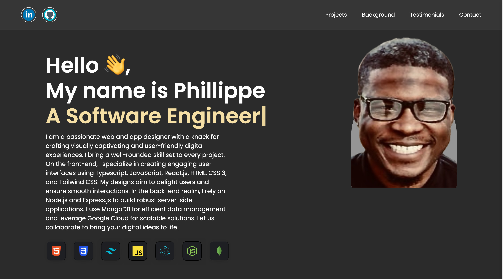
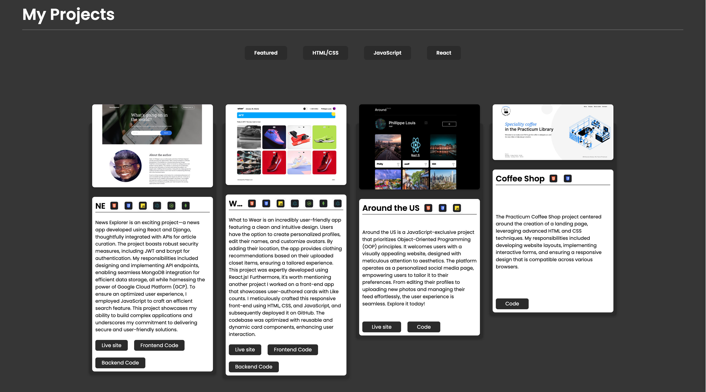
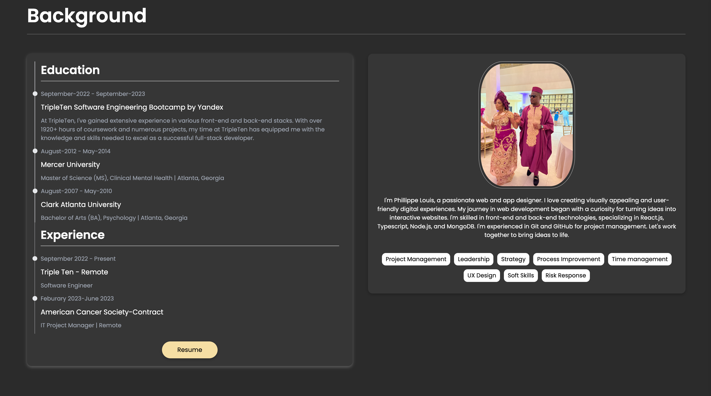
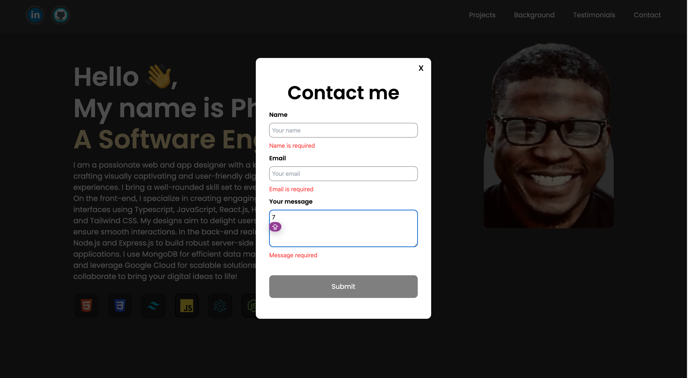

# About my portfolio

This project serves as my portfolio website, showcasing information about me, my work, and background. Built with React.js and Tailwind CSS, it boasts a seamless and visually appealing UI. Noteworthy features include multiple modals, a meticulously validated form, and a project section allowing users to filter projects by their preferred tech stacks.

# Images from my project

# Live site

In progress
